# 项目文件说明

## 📁 核心文件

| 文件 | 说明 | 用途 |
|-----|------|------|
| `environment.yml` | **Conda 环境配置** | 包含所有依赖,一键创建环境 |
| `requirements.txt` | pip 依赖列表 | 备用方案,不使用 Conda 时用 |
| `config.yaml` | 系统配置文件 | API 密钥、Redis 配置、日志设置 |
| `control_center.py` | **主程序入口** | 运行所有爬虫,控制抓取流程 |
| `validate_config.py` | 配置验证工具 | 检查配置正确性、Redis 连接 |
| `view_redis_data.py` | 数据查看工具 | 查看 Redis 中存储的数据 |

## 🚀 启动脚本

| 文件 | 平台 | 功能 |
|-----|------|------|
| `start_redis.bat` | Windows | 自动检测环境、启动 Redis、运行验证 |
| `run.sh` | Linux/macOS | 同上,提供操作菜单 |

## 📖 文档文件

| 文件 | 说明 |
|-----|------|
| `README.md` | 项目完整文档 |
| `QUICKSTART.md` | 3 分钟快速开始 |
| `Docker_Redis配置指南.md` | Redis 详细配置说明 |
| `docs/` | 详细技术文档目录 |

## 🔧 代码模块

### crawlers/ (爬虫模块)

```
crawlers/
├── reddit_crawler.py      # Reddit 爬虫 (praw)
├── newsapi_crawler.py     # NewsAPI 爬虫 (newsapi-python)
├── rss_crawler.py         # RSS 爬虫 (feedparser)
├── stocktwits_crawler.py  # StockTwits 爬虫 (requests)
└── twitter_crawler.py     # Twitter 爬虫 (snscrape/twint)
```

### utils/ (工具模块)

```
utils/
├── redis_client.py        # Redis 连接与操作
├── data_exporter.py       # 数据导出 (Parquet/JSON)
├── logger.py              # 日志配置
└── check_dependencies.py  # 依赖检查工具
```

### tests/ (测试模块)

```
tests/
├── test_redis_client.py   # Redis 客户端测试
├── test_data_exporter.py  # 数据导出测试
└── test_rss_crawler.py    # RSS 爬虫测试
```

## 📦 数据目录

| 目录 | 说明 | Git 状态 |
|-----|------|---------|
| `data_exports/` | 导出的数据文件 (JSON/Parquet) | 忽略数据文件,保留 README |
| `logs/` | 日志文件 | 忽略 |
| `redis_data/` | Redis 持久化数据 (Docker 挂载) | 忽略 |

## 🔍 文件用途速查

### 新用户入门

1. **安装环境**: `environment.yml`
2. **配置密钥**: `config.yaml`
3. **启动系统**: `start_redis.bat` (Windows) 或 `run.sh` (Linux)
4. **查看文档**: `QUICKSTART.md` → `README.md` → `docs/`

### 开发者

1. **主程序**: `control_center.py`
2. **添加爬虫**: 在 `crawlers/` 目录
3. **修改工具**: 在 `utils/` 目录
4. **运行测试**: `pytest tests/ -v`

### 运维人员

1. **配置检查**: `python validate_config.py`
2. **查看数据**: `python view_redis_data.py`
3. **查看日志**: `logs/` 目录
4. **导出数据**: `data_exports/` 目录

## 🚫 不需要的文件

以下文件/目录可以忽略:

- `__pycache__/` - Python 缓存
- `.dockerignore` - Docker 构建忽略 (高级用户)
- `Dockerfile` - 容器化部署 (高级用户)
- `pytest.ini` - 测试配置 (开发者)

## 📋 依赖关系

```
环境创建
├── environment.yml (推荐) → Conda 环境
└── requirements.txt (备用) → pip 安装

配置文件
└── config.yaml → 所有模块读取配置

主程序
├── control_center.py
│   ├── crawlers/*.py (5个爬虫)
│   └── utils/redis_client.py
└── utils/
    ├── logger.py (日志)
    └── data_exporter.py (导出)

启动脚本
├── start_redis.bat (Windows)
│   ├── 检测环境 (cs5481)
│   ├── 启动 Docker Redis
│   └── 运行 validate_config.py
└── run.sh (Linux/macOS)
    └── 同上 + 操作菜单
```

## 🎯 工作流程

### 初次使用

```mermaid
graph LR
    A[克隆项目] --> B[创建环境]
    B --> C[配置密钥]
    C --> D[运行启动脚本]
    D --> E[选择操作]
```



1. `git clone <repo>` → 克隆项目
2. `conda env create -f environment.yml` → 创建环境
3. 编辑 `config.yaml` → 配置密钥
4. `.\start_redis.bat` → 启动脚本
5. 选择菜单选项 → 运行/查看数据

### 日常开发

```mermaid
graph LR
    A[激活环境] --> B[修改代码]
    B --> C[运行测试]
    C --> D[提交代码]
```



1. `conda activate cs5481` → 激活环境
2. 修改 `crawlers/` 或 `utils/` → 开发功能
3. `pytest tests/ -v` → 运行测试
4. `git commit` → 提交代码

---

**更新时间**: 2025-10-20
